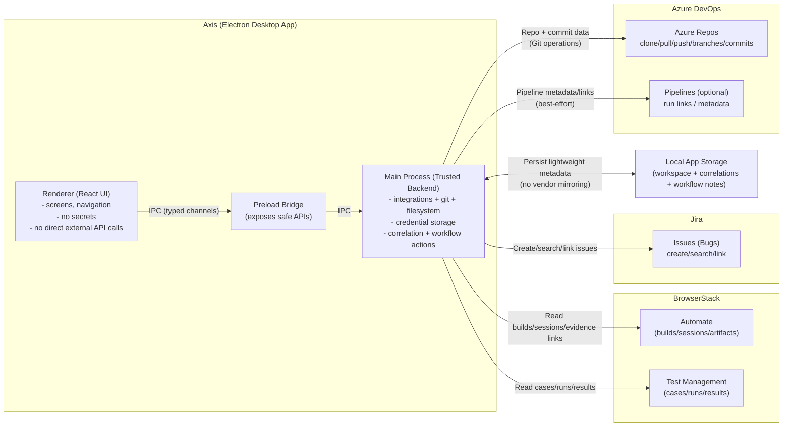

# Integrations Architecture Diagram

This diagram shows (at a high level) how Axis connects to **BrowserStack**, **Jira**, and **Azure DevOps**.

## Big picture: Axis as the “workflow hub”

## What this means in practice

- Axis **never calls vendor APIs from the renderer**. The UI requests data via IPC, and the **main process** performs the network and git operations.
- Axis correlates objects across systems into a single “failure narrative,” e.g.:
  - Test result (TM) ↔ session evidence (Automate) ↔ defect (Jira) ↔ code change (Azure Repos)
- All enrichment is **best-effort**: if a system is unavailable, Axis should degrade gracefully and still show what it can.

## Related docs

- [Architecture Overview](./overview.md)
- [IPC Contract](./ipc.md)
- [E2E Workflow Flowcharts](../workflows/e2e-flow.md)

