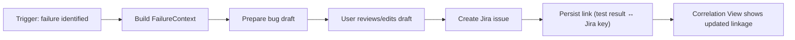
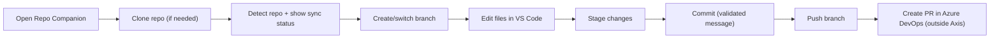

# E2E Workflow Flowcharts

These flowcharts show how Axis is used end-to-end across **BrowserStack**, **Test Management**, **Jira**, and **Azure DevOps**.

## High-level E2E: Triage → Evidence → Defect → Traceability

```mermaid
flowchart LR
  A["Start: Tester opens Axis"] --> B["Select / confirm workspace"]
  B --> C["Settings: verify integrations configured"]

  C --> D["Dashboard: overview + recent activity"]
  D --> E["Test Management: find failed case / result"]
  E --> F["Failure details: read error + context"]

  F --> G["Evidence: open BrowserStack session artifacts"]
  G --> H["Correlation View: see linked session / defect / commit"]
  H --> I["Create Jira bug (draft → review → create)"]

  I --> J["Repo Companion: inspect repo status (optional)"]
  J --> K["Traceability: link failure ↔ evidence ↔ Jira ↔ code change"]
  K --> L["Done: defect is actionable with evidence links"]
```

## Jira Bug Creation (Axis V1) — Evidence-first

## Repo Companion (QA workflow) — Safe Git loop

## Notes

- Axis is a **triage and workflow hub** (not a local test runner).
- In V1, Jira descriptions prioritize **links to evidence** and environment context.

